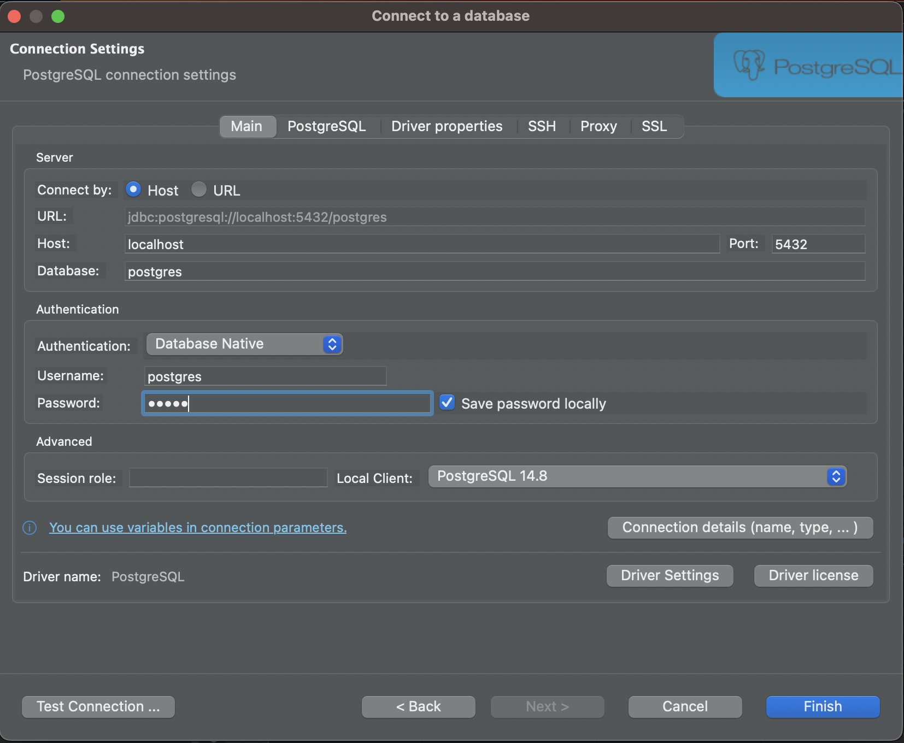
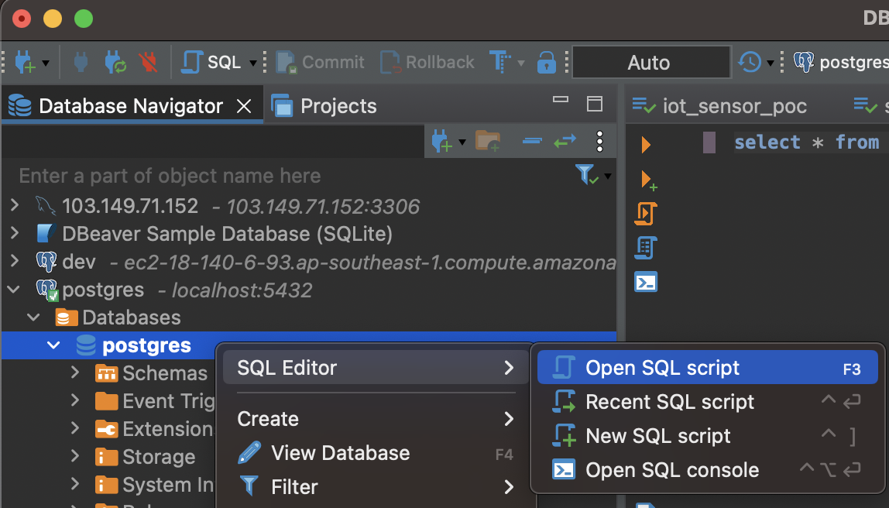
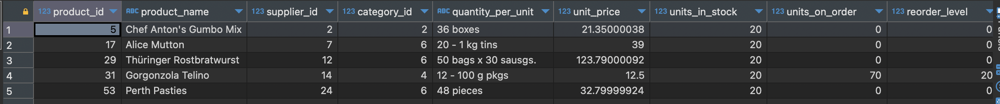
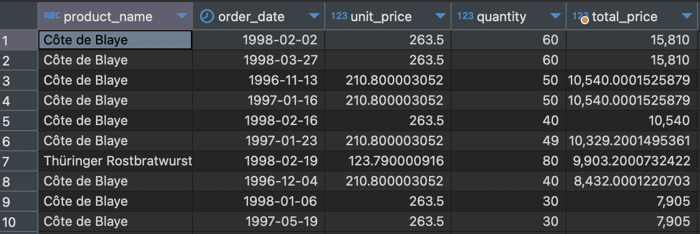
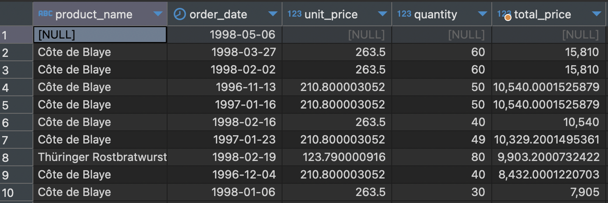
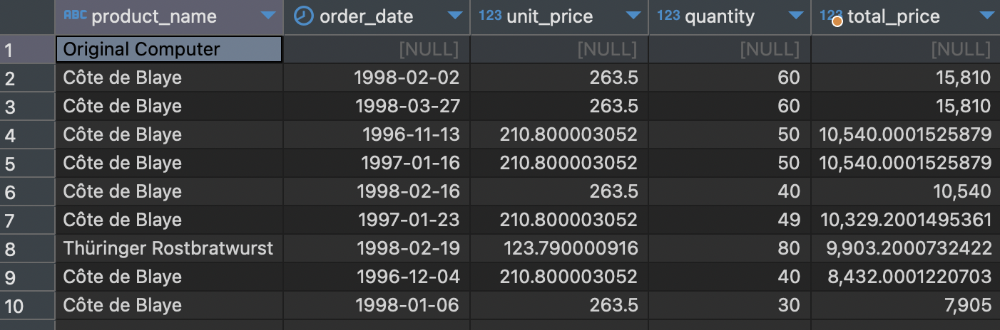
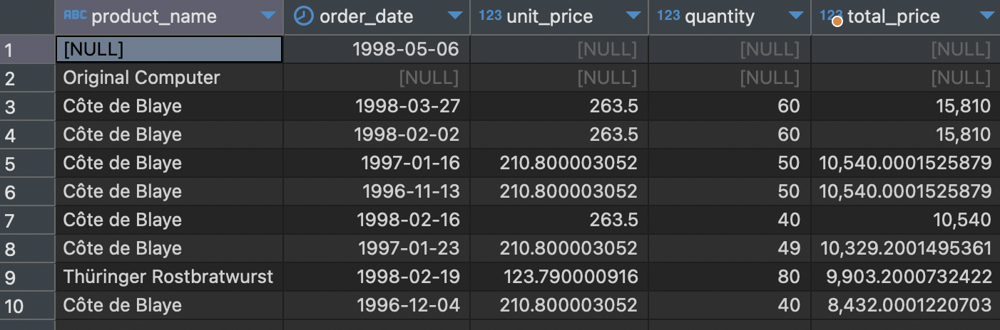

# Hands ON materi Workshop Intro SQL
This Repository contain source code for event Workshop Intro SQL using PostgreSQL

## Prerequisite
- PostgreSQL version 14 or above with include pgadmin. [Download](https://www.enterprisedb.com/downloads/postgres-postgresql-downloads)
- DBeaver. [Download](https://dbeaver.io/download/)
- VSCode (optional). [Download](https://code.visualstudio.com/download)

<br>

## 1) Create New Database Connection
- Open DBeaver
- Click New Database Connection
- Choose PostgreSQL then click Next
- Input Host : localhost, databases postgres, username: postgres, password: your DB password then click Finish


<br>

## 2) Create New Database
- Right click databases postgres then click SQL Editor --> Open SQL script

- Type Query bellow then click execute sql query
  ```
  CREATE DATABASE demo_intro_sql;
  ```
<br>

## 3) Hands On DDL
### 3.1 CREATE Table
- Type Query bellow in SQL Editor for Create new Table
```
CREATE TABLE book(
    book_id SERIAL PRIMARY KEY,
    book_name VARCHAR(50),
    book_category VARCHAR(15),
    qty INT,
    unit_price REAL  
);
```
<br>

### 3.2 Alter Table
#### 3.2.1 ALTER Table Add Column
- Type Query bellow in SQL Editor
  ```
  ALTER TABLE book
  ADD COLUMN created_dt DATE,
  ADD COLUMN changed_dt DATE,
  ADD COLUMN to_be_deleted INT; 
  ```
#### 3.2.2 ALTER Table Drop Column
- Type Query bellow in SQL Editor
  ~~~
  ALTER TABLE book
  DROP COLUMN created_dt, 
  DROP COLUMN changed_dt;
  ~~~
#### 3.2.3 ALTER Table Rename Column
- Type Query bellow in SQL Editor
  ~~~
  ALTER TABLE book
  RENAME COLUMN qty TO unit_qty;
  ~~~
#### 3.2.4 ALTER Table Modify Datatype
- Type Query bellow in SQL Editor
  ```
  ALTER TABLE book
  ALTER COLUMN to_be_deleted TYPE VARCHAR;
  ```
<br>

### 3.3 TRUNCATE Table
- Type Query bellow in SQL Editor
  ```
  TRUNCATE TABLE book;
  ```
<br>

## 4) Hands On DML
### 4.1 INSERT Data
- Download Example Database northwind [here](https://github.com/pthom/northwind_psql/blob/master/northwind.sql).
- Open northwind.sql in DBever then run all query
- Type Query bellow in SQL Editor
  ```
  INSERT INTO categories VALUES (9, 'Fruits', 'Fruits like Banana, mango, Apple etc', '\x');
  ```
<br>

### 4.2 UPDATE Data
- Retrieve all data in products table using query bellow.
  ```
  SELECT * FROM products;
  ```
- We see there are several product that have stock is 0 so we need update value to not 0. In this workshop, update stock become 20. Type query UPDATE bellow :
  ```
  UPDATE products
  SET units_in_stock = 20
  WHERE units_in_stock = 0
  RETURNING *;
  ```
  
<br>

### 4.3 DELETE Data
- Type Query bellow in SQL Editor
  ```
  DELETE FROM categories
  WHERE category_name = 'Fruits'
  RETURNING *;
  ```

<br>

## 5) Hands On DQL
### 5.1 Basic Select
```
SELECT * FROM products;
```
### 5.2 Select with Where clause
```
SELECT * FROM products
WHERE unit_price > 10
```
### 5.3 Select with sorting column
```
SELECT * FROM products
WHERE unit_price > 10
ORDER BY units_in_stocks DESC
```
### 5.4 Limit Retrieve Data
- Retrieve Top 10 Data
  ```
  SELECT * FROM products
  WHERE unit_price > 10
  ORDER BY units_in_stocks DESC
  LIMIT 10
  ```
- Retrieve Top 10 Data with skip 2 record from top
  ```
  SELECT * FROM products
  WHERE unit_price > 10
  ORDER BY units_in_stocks DESC
  LIMIT 10 OFFSET 2
  ```
### 5.5 Display Unique Data
```
SELECT DISTINCT category_id
FROM products
```
### 5.6 Aggregate Function
- Display maximum value of unit_price in products table
  ```
  SELECT max(unit_price) as max_unit_price FROM products
  ```
- Display minimum value of unit_price in products table
  ```
  SELECT min(unit_price) as min_unit_price FROM products
  ```

- Display total data in products table
  ```
  SELECT count(*) as total_data FROM products
  ```

- Display total of unit_price in products table
  ```
  SELECT sum(unit_price) as sum_unit_price FROM products
  ```

- Display average of unit_price in products table
  ```
  SELECT avg(unit_price) as average_unit_price FROM products
  ```

### 5.7 Grouping Data
- Display Top 10 product name and maximum unit price with grouping by product name, sorting with highest maximum unit price 
  ```
  SELECT product_name, max(unit_price) as max_unit_price 
  FROM products
  GROUP BY product_name
  ORDER BY max_unit_price DESC
  LIMIT 10
  ```

- Display Top 10 product name and maximum unit price with grouping by product name, sorting with highest maximum unit price and also maximum unit price more than 50
  ```
  SELECT product_name, max(unit_price) as max_unit_price 
  FROM products
  GROUP BY product_name
  HAVING max(unit_price) > 50
  ORDER BY max_unit_price DESC
  LIMIT 10
  ```

### 5.8 JOIN
- Display territory and region using JOIN
  ```
  SELECT t.territory_description, r.region_description
  FROM territories t, region r
  WHERE t.region_id = r.region_id
  ```
  ```
  SELECT t.territory_description, r.region_description
  FROM territories t INNER JOIN region r
  ON t.region_id = r.region_id
- Display top 10 product name, order date, price, quantity and total price with sort by highest total price using INNER JOIN  
  ```
  SELECT
  p.product_name,
  o.order_date,
  od.unit_price,
  od.quantity,
  (od.unit_price * od.quantity) total_price
  FROM orders o
  INNER JOIN order_details od
  ON o.order_id = od.order_id
  INNER JOIN products p
  ON od.product_id = p.product_id
  GROUP BY
  p.product_name,
  o.order_date,
  od.unit_price,
  od.quantity
  ORDER BY total_price desc
  LIMIT 10
  ```
  
- Display top 10 product name, order date, price, quantity and total price with sort by highest total price using LEFT JOIN
  - Add 1 record in orders table only
    ```
    INSERT INTO orders 
    VALUES (11078, 'SIMOB', 7, '1998-05-06', '1998-06-03', NULL, 2, 18.4400005, 'Simons bistro', 'Vinbæltet 34', 'Kobenhavn', NULL, '1734', 'Denmark');
    ```
  - Run query bellow 
    ```
    SELECT
    p.product_name,
    o.order_date,
    od.unit_price,
    od.quantity,
    (od.unit_price * od.quantity) total_price
    FROM orders o
    LEFT JOIN order_details od
    ON o.order_id = od.order_id
    LEFT JOIN products p
    ON od.product_id = p.product_id
    GROUP BY
    p.product_name,
    o.order_date,
    od.unit_price,
    od.quantity
    ORDER BY total_price DESC
    LIMIT 10
    ```
    
- Display top 10 product name, order date, price, quantity and total price with sort by highest total price using RIGHT JOIN
  - Add 1 record in products table only
    ```
    INSERT INTO products 
    VALUES (78, 'Original Computer', 13, 2, '12 boxes', 13, 32, 0, 15, 0);
    ```
  - Run query bellow
    ```
    SELECT
    p.product_name,
    o.order_date,
    od.unit_price,
    od.quantity,
    (od.unit_price * od.quantity) total_price
    FROM orders o
    RIGHT JOIN order_details od
    ON o.order_id = od.order_id
    RIGHT JOIN products p
    ON od.product_id = p.product_id
    GROUP BY
    p.product_name,
    o.order_date,
    od.unit_price,
    od.quantity
    ORDER BY total_price DESC
    LIMIT 10
    ```
    
- Display top 10 product name, order date, price, quantity and total price with sort by highest total price using FULL JOIN
  ```
  SELECT
  p.product_name,
  o.order_date,
  od.unit_price,
  od.quantity,
  (od.unit_price * od.quantity) total_price
  FROM orders o
  FULL JOIN order_details od
  ON o.order_id = od.order_id
  FULL JOIN products p
  ON od.product_id = p.product_id
  GROUP BY
  p.product_name,
  o.order_date,
  od.unit_price,
  od.quantity
  ORDER BY total_price DESC
  LIMIT 10
  ```
  

  <b>

## 5) Challenge Question
Please click this [link](./challenges.md)

