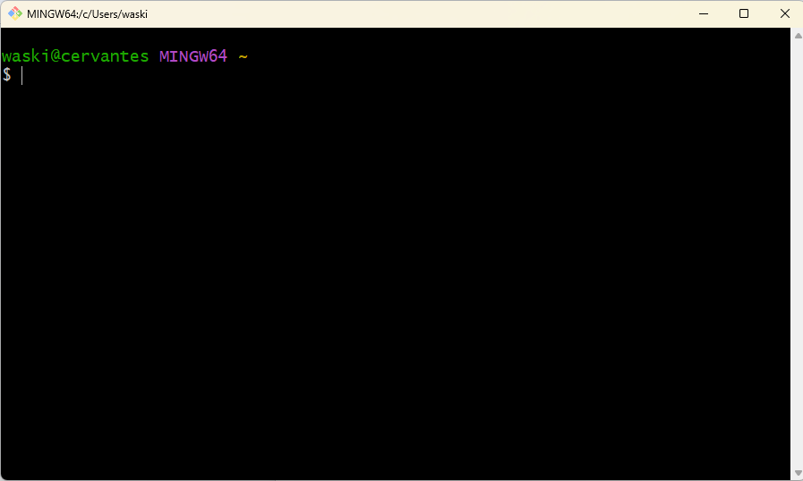
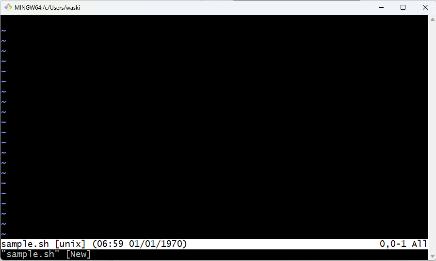

# Let’s start!

## Shell Script. What is it?

In the Data Engineering context, a shell script is a powerful tool that enables us to interact with the command-line interface (CLI) of our operating system and execute a series of commands in a sequential manner. It allows us to `automate tasks` and `streamline our data workflows`.

We will use a shell script called `bash`, which is widely used in the industry and offers a rich set of features and functionalities for scripting purposes.

## Understand your Shell Environment.

- A Terminal: Linux or Mac users will be using your default terminal app, while Windows users can use GitBash for the terminal.

- Let's try it using some basic commands
    * $ ls 
    * $ pwd
    * $ cd
    * $ echo

     

- A Text Editor: It’s really a weapon of choice, you can use your favorite text editor.
  We will use `vim` for this course, please adjust it to your preferred text editor.
  
- Shell Scripting libraries:
  - grep
  - awk
  - sed
  - etc.

